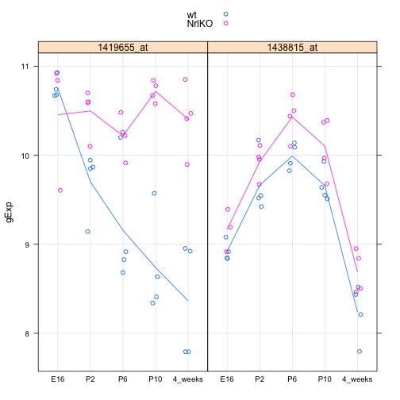
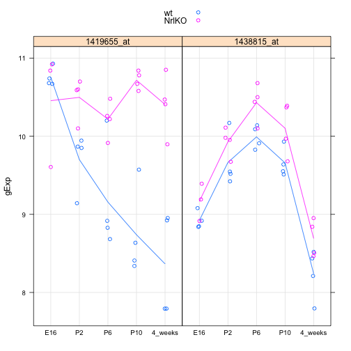
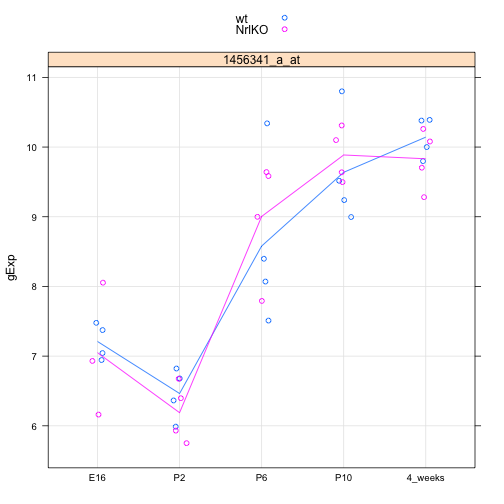
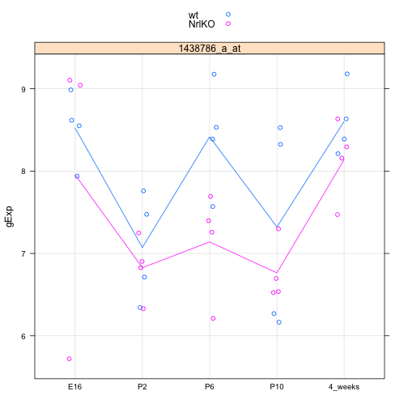
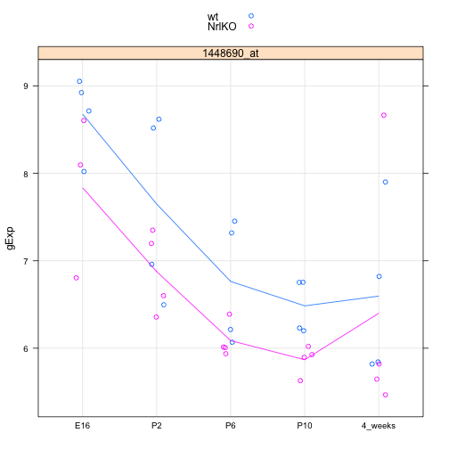
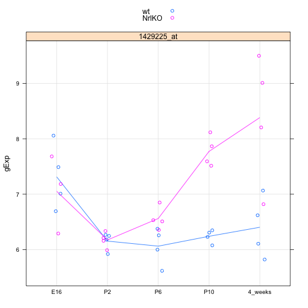

<!-- Automatically generated by RStudio [12861c30b10411e1afa60800200c9a66] -->
### Seminar05.R
Abrar --- *Feb 13, 2014, 10:25 PM*

```r

# Load the photoRec data and the lattice package --------------------------


library(lattice)
prDat <- read.table("../data/GSE4051_data.tsv")
str(prDat, max.level=0)
```

```
'data.frame':	29949 obs. of  39 variables:
```

```r

prDes <- readRDS("../data/GSE4051_design.rds")
str(prDes)
```

```
'data.frame':	39 obs. of  4 variables:
 $ sidChar : chr  "Sample_20" "Sample_21" "Sample_22" "Sample_23" ...
 $ sidNum  : num  20 21 22 23 16 17 6 24 25 26 ...
 $ devStage: Factor w/ 5 levels "E16","P2","P6",..: 1 1 1 1 1 1 1 2 2 2 ...
 $ gType   : Factor w/ 2 levels "wt","NrlKO": 1 1 1 1 2 2 2 1 1 1 ...
```

```r


# Write a function to prepare a mini-dataset for a small number of --------


prepareData <- function(g){
  pDat0 <- data.frame()
  for(i in 1:length(g)){
    pDat <- data.frame(prDes, gExp = as.vector(t(as.matrix(prDat[g[i], ]))), gene=g[i])
    pDat0 <- rbind(pDat0,pDat)
  }
  pDat0
}

(luckyGenes <- c("1419655_at","1438815_at"))
```

```
[1] "1419655_at" "1438815_at"
```

```r
jDat <- prepareData(luckyGenes)
str(jDat)
```

```
'data.frame':	78 obs. of  6 variables:
 $ sidChar : chr  "Sample_20" "Sample_21" "Sample_22" "Sample_23" ...
 $ sidNum  : num  20 21 22 23 16 17 6 24 25 26 ...
 $ devStage: Factor w/ 5 levels "E16","P2","P6",..: 1 1 1 1 1 1 1 2 2 2 ...
 $ gType   : Factor w/ 2 levels "wt","NrlKO": 1 1 1 1 2 2 2 1 1 1 ...
 $ gExp    : num  10.93 10.74 10.67 10.68 9.61 ...
 $ gene    : Factor w/ 2 levels "1419655_at","1438815_at": 1 1 1 1 1 1 1 1 1 1 ...
```

```r
head(jDat)
```

```
     sidChar sidNum devStage gType   gExp       gene
12 Sample_20     20      E16    wt 10.930 1419655_at
13 Sample_21     21      E16    wt 10.740 1419655_at
14 Sample_22     22      E16    wt 10.670 1419655_at
15 Sample_23     23      E16    wt 10.680 1419655_at
9  Sample_16     16      E16 NrlKO  9.606 1419655_at
10 Sample_17     17      E16 NrlKO 10.840 1419655_at
```

```r
tail(jDat)
```

```
      sidChar sidNum devStage gType  gExp       gene
71  Sample_38     38  4_weeks    wt 8.211 1438815_at
81  Sample_39     39  4_weeks    wt 8.436 1438815_at
110 Sample_11     11  4_weeks NrlKO 8.465 1438815_at
210 Sample_12     12  4_weeks NrlKO 8.841 1438815_at
310  Sample_2      2  4_weeks NrlKO 8.506 1438815_at
41   Sample_9      9  4_weeks NrlKO 8.952 1438815_at
```

```r
stripplot(gExp ~ devStage | gene, jDat, group = gType, jitter.data = TRUE, auto.key = TRUE, type = c('p', 'a'), grid = TRUE)
```

 

```r


# Write a function to stripplot a mini-dataset ----------------------------


makeStripplot <- function(x){
  stripplot(gExp ~ devStage | gene, x, group = gType, jitter.data = TRUE, auto.key = TRUE, type = c('p', 'a'), grid = TRUE)
}
makeStripplot(jDat)
```

 

```r
makeStripplot(newDat <- prepareData("1456341_a_at"))
```

 

```r
str(newDat)
```

```
'data.frame':	39 obs. of  6 variables:
 $ sidChar : chr  "Sample_20" "Sample_21" "Sample_22" "Sample_23" ...
 $ sidNum  : num  20 21 22 23 16 17 6 24 25 26 ...
 $ devStage: Factor w/ 5 levels "E16","P2","P6",..: 1 1 1 1 1 1 1 2 2 2 ...
 $ gType   : Factor w/ 2 levels "wt","NrlKO": 1 1 1 1 2 2 2 1 1 1 ...
 $ gExp    : num  7.04 7.48 7.37 6.94 6.16 ...
 $ gene    : Factor w/ 1 level "1456341_a_at": 1 1 1 1 1 1 1 1 1 1 ...
```

```r
head(newDat)
```

```
     sidChar sidNum devStage gType  gExp         gene
12 Sample_20     20      E16    wt 7.044 1456341_a_at
13 Sample_21     21      E16    wt 7.478 1456341_a_at
14 Sample_22     22      E16    wt 7.374 1456341_a_at
15 Sample_23     23      E16    wt 6.944 1456341_a_at
9  Sample_16     16      E16 NrlKO 6.161 1456341_a_at
10 Sample_17     17      E16 NrlKO 6.931 1456341_a_at
```

```r


# Do a two-sample t-test --------------------------------------------------


pDat <- prepareData("1456341_a_at")
(someDat <- subset(pDat, devStage == "P2"| devStage == "4_weeks" ))
```

```
     sidChar sidNum devStage gType   gExp         gene
28 Sample_24     24       P2    wt  6.822 1456341_a_at
29 Sample_25     25       P2    wt  6.364 1456341_a_at
30 Sample_26     26       P2    wt  6.679 1456341_a_at
31 Sample_27     27       P2    wt  5.988 1456341_a_at
24 Sample_14     14       P2 NrlKO  6.675 1456341_a_at
25  Sample_3      3       P2 NrlKO  5.931 1456341_a_at
26  Sample_5      5       P2 NrlKO  5.751 1456341_a_at
27  Sample_8      8       P2 NrlKO  6.396 1456341_a_at
5  Sample_36     36  4_weeks    wt 10.390 1456341_a_at
6  Sample_37     37  4_weeks    wt  9.798 1456341_a_at
7  Sample_38     38  4_weeks    wt 10.380 1456341_a_at
8  Sample_39     39  4_weeks    wt 10.000 1456341_a_at
1  Sample_11     11  4_weeks NrlKO 10.260 1456341_a_at
2  Sample_12     12  4_weeks NrlKO  9.704 1456341_a_at
3   Sample_2      2  4_weeks NrlKO 10.080 1456341_a_at
4   Sample_9      9  4_weeks NrlKO  9.281 1456341_a_at
```

```r
t.test(gExp ~ devStage, someDat )
```

```

	Welch Two Sample t-test

data:  gExp by devStage
t = -18.84, df = 13.98, p-value = 2.477e-11
alternative hypothesis: true difference in means is not equal to 0
95 percent confidence interval:
 -4.078 -3.244
sample estimates:
     mean in group P2 mean in group 4_weeks 
                6.326                 9.987 
```

```r


# Fit a linear model with a categorical covariate -------------------------


mDat <- prepareData("1438786_a_at")
mFit <- lm(formula = gExp ~ devStage, data = mDat, subset = gType ==  "wt")
summary(mFit)
```

```

Call:
lm(formula = gExp ~ devStage, data = mDat, subset = gType == 
    "wt")

Residuals:
    Min      1Q  Median      3Q     Max 
-1.1565 -0.4400  0.0288  0.4915  1.2065 

Coefficients:
                Estimate Std. Error t value Pr(>|t|)    
(Intercept)        8.523      0.379   22.50  5.7e-13 ***
devStageP2        -1.450      0.536   -2.71    0.016 *  
devStageP6        -0.107      0.536   -0.20    0.845    
devStageP10       -1.201      0.536   -2.24    0.040 *  
devStage4_weeks    0.081      0.536    0.15    0.882    
---
Signif. codes:  0 '***' 0.001 '**' 0.01 '*' 0.05 '.' 0.1 ' ' 1

Residual standard error: 0.758 on 15 degrees of freedom
Multiple R-squared:  0.497,	Adjusted R-squared:  0.363 
F-statistic: 3.71 on 4 and 15 DF,  p-value: 0.0272
```

```r
makeStripplot(mDat)
```

 

```r

# Vet your inferential results: does the intercept look plausible given the plot? How about the devStageP2 effect, etc.?
# Yes it does, as it shows how devStageP2 and DevstageP10 effects are quite different than the rest of devStages


# Perform inference for a contrast ----------------------------------------


mFit
```

```

Call:
lm(formula = gExp ~ devStage, data = mDat, subset = gType == 
    "wt")

Coefficients:
    (Intercept)       devStageP2       devStageP6      devStageP10  
          8.523           -1.450           -0.107           -1.201  
devStage4_weeks  
          0.081  
```

```r
contMat <- matrix(c(0, 1, 0, -1, 0), nrow=1)
contMat
```

```
     [,1] [,2] [,3] [,4] [,5]
[1,]    0    1    0   -1    0
```

```r
(obsDiff <- contMat %*% coef(mFit))
```

```
       [,1]
[1,] -0.249
```

```r
(sampMeans <- aggregate(gExp ~ devStage, mDat, FUN = mean,  subset = gType == "wt"))
```

```
  devStage  gExp
1      E16 8.523
2       P2 7.072
3       P6 8.416
4      P10 7.322
5  4_weeks 8.604
```

```r
with(sampMeans, gExp[devStage == "P2"] - gExp[devStage == "P10"])
```

```
[1] -0.249
```

```r

# The variance-covariance matrix of the parameters estimated in the original model can be obtained with
vcov(mFit)
```

```
                (Intercept) devStageP2 devStageP6 devStageP10
(Intercept)          0.1435    -0.1435    -0.1435     -0.1435
devStageP2          -0.1435     0.2870     0.1435      0.1435
devStageP6          -0.1435     0.1435     0.2870      0.1435
devStageP10         -0.1435     0.1435     0.1435      0.2870
devStage4_weeks     -0.1435     0.1435     0.1435      0.1435
                devStage4_weeks
(Intercept)             -0.1435
devStageP2               0.1435
devStageP6               0.1435
devStageP10              0.1435
devStage4_weeks          0.2870
```

```r

# Checking standard errors:
summary(mFit)$coefficients[ , "Std. Error"]
```

```
    (Intercept)      devStageP2      devStageP6     devStageP10 
         0.3788          0.5357          0.5357          0.5357 
devStage4_weeks 
         0.5357 
```

```r
sqrt(diag(vcov(mFit)))
```

```
    (Intercept)      devStageP2      devStageP6     devStageP10 
         0.3788          0.5357          0.5357          0.5357 
devStage4_weeks 
         0.5357 
```

```r
# Yes they are equal to the sd reproted for out original model!


summary(mFit)$coefficients
```

```
                Estimate Std. Error t value  Pr(>|t|)
(Intercept)       8.5227     0.3788 22.4979 5.697e-13
devStageP2       -1.4503     0.5357 -2.7070 1.623e-02
devStageP6       -0.1067     0.5357 -0.1993 8.447e-01
devStageP10      -1.2012     0.5357 -2.2422 4.049e-02
devStage4_weeks   0.0810     0.5357  0.1512 8.818e-01
```

```r

(estSe <- contMat %*% vcov(mFit) %*% t(contMat))
```

```
      [,1]
[1,] 0.287
```

```r
(testStat <- obsDiff/estSe)
```

```
        [,1]
[1,] -0.8676
```

```r

2 * pt(abs(testStat), df = df.residual(mFit), lower.tail = FALSE)
```

```
       [,1]
[1,] 0.3993
```

```r


# Fit a linear model with two categorical covariates  ---------------------
makeStripplot(oDat <- prepareData("1448690_at"))
```

 

```r
str(oDat)
```

```
'data.frame':	39 obs. of  6 variables:
 $ sidChar : chr  "Sample_20" "Sample_21" "Sample_22" "Sample_23" ...
 $ sidNum  : num  20 21 22 23 16 17 6 24 25 26 ...
 $ devStage: Factor w/ 5 levels "E16","P2","P6",..: 1 1 1 1 1 1 1 2 2 2 ...
 $ gType   : Factor w/ 2 levels "wt","NrlKO": 1 1 1 1 2 2 2 1 1 1 ...
 $ gExp    : num  8.02 9.05 8.71 8.92 6.8 ...
 $ gene    : Factor w/ 1 level "1448690_at": 1 1 1 1 1 1 1 1 1 1 ...
```

```r

oFitBig <- lm(formula = gExp ~ gType * devStage, data = oDat)
summary(oFitBig)$coef
```

```
                           Estimate Std. Error  t value  Pr(>|t|)
(Intercept)                 8.67800     0.3987 21.76755 1.634e-19
gTypeNrlKO                 -0.84233     0.6090 -1.38320 1.772e-01
devStageP2                 -1.02900     0.5638 -1.82512 7.830e-02
devStageP6                 -1.91450     0.5638 -3.39571 2.003e-03
devStageP10                -2.19325     0.5638 -3.89012 5.387e-04
devStage4_weeks            -2.08200     0.5638 -3.69280 9.149e-04
gTypeNrlKO:devStageP2       0.06983     0.8299  0.08415 9.335e-01
gTypeNrlKO:devStageP6       0.16533     0.8299  0.19922 8.435e-01
gTypeNrlKO:devStageP10      0.22583     0.8299  0.27212 7.875e-01
gTypeNrlKO:devStage4_weeks  0.64608     0.8299  0.77852 4.426e-01
```

```r
summary(oFitBig)
```

```

Call:
lm(formula = gExp ~ gType * devStage, data = oDat)

Residuals:
    Min      1Q  Median      3Q     Max 
-1.1520 -0.5646  0.0278  0.3120  2.2663 

Coefficients:
                           Estimate Std. Error t value Pr(>|t|)    
(Intercept)                  8.6780     0.3987   21.77  < 2e-16 ***
gTypeNrlKO                  -0.8423     0.6090   -1.38  0.17716    
devStageP2                  -1.0290     0.5638   -1.83  0.07830 .  
devStageP6                  -1.9145     0.5638   -3.40  0.00200 ** 
devStageP10                 -2.1932     0.5638   -3.89  0.00054 ***
devStage4_weeks             -2.0820     0.5638   -3.69  0.00091 ***
gTypeNrlKO:devStageP2        0.0698     0.8299    0.08  0.93352    
gTypeNrlKO:devStageP6        0.1653     0.8299    0.20  0.84348    
gTypeNrlKO:devStageP10       0.2258     0.8299    0.27  0.78745    
gTypeNrlKO:devStage4_weeks   0.6461     0.8299    0.78  0.44257    
---
Signif. codes:  0 '***' 0.001 '**' 0.01 '*' 0.05 '.' 0.1 ' ' 1

Residual standard error: 0.797 on 29 degrees of freedom
Multiple R-squared:  0.59,	Adjusted R-squared:  0.463 
F-statistic: 4.64 on 9 and 29 DF,  p-value: 0.000734
```

```r
oFitSmall <- lm(formula = gExp ~ gType + devStage, data = oDat)
summary(oFitSmall)$coef
```

```
                Estimate Std. Error t value  Pr(>|t|)
(Intercept)       8.5803     0.3046  28.165 1.177e-24
gTypeNrlKO       -0.6144     0.2430  -2.528 1.643e-02
devStageP2       -1.0104     0.3924  -2.575 1.470e-02
devStageP6       -1.8481     0.3924  -4.710 4.328e-05
devStageP10      -2.0966     0.3924  -5.343 6.703e-06
devStage4_weeks  -1.7752     0.3924  -4.524 7.444e-05
```

```r
anova(oFitBig, oFitSmall)
```

```
Analysis of Variance Table

Model 1: gExp ~ gType * devStage
Model 2: gExp ~ gType + devStage
  Res.Df  RSS Df Sum of Sq   F Pr(>F)
1     29 18.4                        
2     33 18.9 -4    -0.497 0.2   0.94
```

```r

# Is the intercept plausible? How about the various effects? Do the ones with small p-values, e.g. meeting a conventional cut-off of 0.05, look 'real' to you?
# Yes the intercept does look plausible. The p-values showes that there is a significant effect in the developmental Stage.  

makeStripplot(dDat <- prepareData("1429225_at"))
```

 

```r
dFitBig <- lm(formula = gExp ~ gType * devStage, data = dDat)
summary(dFitBig)
```

```

Call:
lm(formula = gExp ~ gType * devStage, data = dDat)

Residuals:
    Min      1Q  Median      3Q     Max 
-1.5625 -0.1951  0.0268  0.1857  1.1145 

Coefficients:
                           Estimate Std. Error t value Pr(>|t|)    
(Intercept)                   7.313      0.262   27.94   <2e-16 ***
gTypeNrlKO                   -0.260      0.400   -0.65   0.5203    
devStageP2                   -1.158      0.370   -3.13   0.0040 ** 
devStageP6                   -1.250      0.370   -3.38   0.0021 ** 
devStageP10                  -1.072      0.370   -2.90   0.0071 ** 
devStage4_weeks              -0.909      0.370   -2.46   0.0203 *  
gTypeNrlKO:devStageP2         0.280      0.545    0.51   0.6107    
gTypeNrlKO:devStageP6         0.759      0.545    1.39   0.1742    
gTypeNrlKO:devStageP10        1.791      0.545    3.29   0.0026 ** 
gTypeNrlKO:devStage4_weeks    2.239      0.545    4.11   0.0003 ***
---
Signif. codes:  0 '***' 0.001 '**' 0.01 '*' 0.05 '.' 0.1 ' ' 1

Residual standard error: 0.523 on 29 degrees of freedom
Multiple R-squared:  0.739,	Adjusted R-squared:  0.659 
F-statistic: 9.14 on 9 and 29 DF,  p-value: 2.1e-06
```

```r
dFitSmall <- lm(formula = gExp ~ gType + devStage, data = dDat)
summary(dFitSmall)$coef
```

```
                Estimate Std. Error t value  Pr(>|t|)
(Intercept)       6.8652     0.2722 25.2199 3.848e-23
gTypeNrlKO        0.7836     0.2172  3.6085 1.007e-03
devStageP2       -1.0926     0.3506 -3.1161 3.780e-03
devStageP6       -0.9446     0.3506 -2.6940 1.101e-02
devStageP10      -0.2506     0.3506 -0.7147 4.798e-01
devStage4_weeks   0.1362     0.3506  0.3883 7.003e-01
```

```r
anova(dFitSmall,dFitBig)
```

```
Analysis of Variance Table

Model 1: gExp ~ gType + devStage
Model 2: gExp ~ gType * devStage
  Res.Df   RSS Df Sum of Sq    F Pr(>F)    
1     33 15.12                             
2     29  7.95  4      7.17 6.54  7e-04 ***
---
Signif. codes:  0 '***' 0.001 '**' 0.01 '*' 0.05 '.' 0.1 ' ' 1
```

