### Seminar 09
#### By: Abrar Wafa


```r
library(RColorBrewer)
library(cluster)
library(pvclust)
library(xtable)
library(limma)
library(plyr)

prDat <- read.table("../data/GSE4051_data.tsv", header = TRUE, row.names = 1)
str(prDat, max.level = 0)
```

```
## 'data.frame':	29949 obs. of  39 variables:
```

```r
prDes <- readRDS("../data/GSE4051_design.rds")
str(prDes)
```

```
## 'data.frame':	39 obs. of  4 variables:
##  $ sidChar : chr  "Sample_20" "Sample_21" "Sample_22" "Sample_23" ...
##  $ sidNum  : num  20 21 22 23 16 17 6 24 25 26 ...
##  $ devStage: Factor w/ 5 levels "E16","P2","P6",..: 1 1 1 1 1 1 1 2 2 2 ...
##  $ gType   : Factor w/ 2 levels "wt","NrlKO": 1 1 1 1 2 2 2 1 1 1 ...
```

```r

sprDat <- t(scale(t(prDat)))
str(sprDat, max.level = 0, give.attr = FALSE)
```

```
##  num [1:29949, 1:39] 0.0838 0.1758 0.7797 -0.3196 0.8358 ...
```

```r
round(data.frame(avgBefore = rowMeans(head(prDat)), avgAfter = rowMeans(head(sprDat)), 
    varBefore = apply(head(prDat), 1, var), varAfter = apply(head(sprDat), 1, 
        var)), 2)
```

```
##              avgBefore avgAfter varBefore varAfter
## 1415670_at        7.22        0      0.02        1
## 1415671_at        9.37        0      0.35        1
## 1415672_at        9.70        0      0.15        1
## 1415673_at        8.42        0      0.03        1
## 1415674_a_at      8.47        0      0.02        1
## 1415675_at        9.67        0      0.03        1
```

```r
pr.dis <- dist(t(sprDat), method = "euclidean")
prDes$grp <- with(prDes, interaction(gType, devStage))
summary(prDes$grp)
```

```
##        wt.E16     NrlKO.E16         wt.P2      NrlKO.P2         wt.P6 
##             4             3             4             4             4 
##      NrlKO.P6        wt.P10     NrlKO.P10    wt.4_weeks NrlKO.4_weeks 
##             4             4             4             4             4
```

```r

# compute hierarchical clustering using different linkage types
pr.hc.s <- hclust(pr.dis, method = "single")
pr.hc.c <- hclust(pr.dis, method = "complete")
pr.hc.a <- hclust(pr.dis, method = "average")
pr.hc.w <- hclust(pr.dis, method = "ward")

# plot them
op <- par(mar = c(0, 4, 4, 2), mfrow = c(2, 2))

plot(pr.hc.s, labels = FALSE, main = "Single", xlab = "")
plot(pr.hc.c, labels = FALSE, main = "Complete", xlab = "")
plot(pr.hc.a, labels = FALSE, main = "Average", xlab = "")
plot(pr.hc.w, labels = FALSE, main = "Ward", xlab = "")
```

 

```r

par(op)

# identify 10 clusters
op <- par(mar = c(1, 4, 4, 1))
plot(pr.hc.w, labels = prDes$grp, cex = 0.6, main = "Ward showing 10 clusters")
rect.hclust(pr.hc.w, k = 10)
```

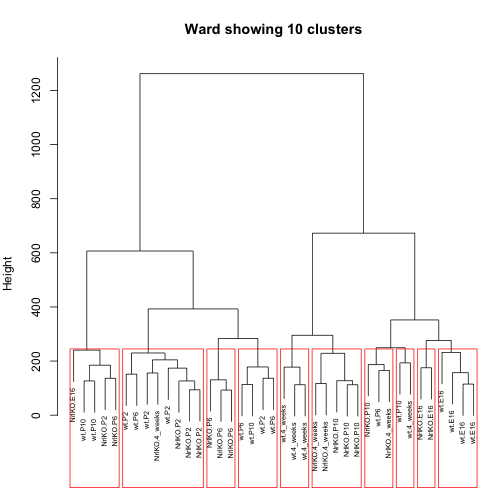 

```r
par(op)

jGraysFun <- colorRampPalette(brewer.pal(n = 9, "Greys"))


################################################################################################################ Changing the seed
set.seed(50)
k <- 5
pr.km <- kmeans(t(sprDat), centers = k, nstart = 50)

# We can look at the within sum of squares of each cluster
pr.km$withinss
```

```
## [1] 100197  78227 133036 110209 120153
```


```r
pr.kmTable <- data.frame(devStage = prDes$devStage, cluster = pr.km$cluster)
prTable <- xtable(with(pr.kmTable, table(devStage, cluster)), caption = "Number of samples from each develomental stage within each k-means cluster")

align(prTable) <- "lccccc"
print(prTable, type = "html", caption.placement = "top")
```

<!-- html table generated in R 3.0.2 by xtable 1.7-3 package -->
<!-- Sun Mar 16 20:05:46 2014 -->
<TABLE border=1>
<CAPTION ALIGN="top"> Number of samples from each develomental stage within each k-means cluster </CAPTION>
<TR> <TH>  </TH> <TH> 1 </TH> <TH> 2 </TH> <TH> 3 </TH> <TH> 4 </TH> <TH> 5 </TH>  </TR>
  <TR> <TD> E16 </TD> <TD align="center">   0 </TD> <TD align="center">   0 </TD> <TD align="center">   1 </TD> <TD align="center">   6 </TD> <TD align="center">   0 </TD> </TR>
  <TR> <TD> P2 </TD> <TD align="center">   0 </TD> <TD align="center">   0 </TD> <TD align="center">   4 </TD> <TD align="center">   0 </TD> <TD align="center">   4 </TD> </TR>
  <TR> <TD> P6 </TD> <TD align="center">   0 </TD> <TD align="center">   1 </TD> <TD align="center">   2 </TD> <TD align="center">   0 </TD> <TD align="center">   5 </TD> </TR>
  <TR> <TD> P10 </TD> <TD align="center">   3 </TD> <TD align="center">   2 </TD> <TD align="center">   2 </TD> <TD align="center">   0 </TD> <TD align="center">   1 </TD> </TR>
  <TR> <TD> 4_weeks </TD> <TD align="center">   5 </TD> <TD align="center">   2 </TD> <TD align="center">   0 </TD> <TD align="center">   1 </TD> <TD align="center">   0 </TD> </TR>
   </TABLE>

```r

# PAM Algorithm:
pr.pam <- pam(pr.dis, k = k)
pr.pamTable <- data.frame(devStage = prDes$devStage, cluster = pr.pam$clustering)
pamTable <- xtable(with(pr.pamTable, table(devStage, cluster)), caption = "Number of samples from each develomental stage within each PAM cluster")

align(pamTable) <- "lccccc"
print(pamTable, type = "html", caption.placement = "top")
```

<!-- html table generated in R 3.0.2 by xtable 1.7-3 package -->
<!-- Sun Mar 16 20:05:46 2014 -->
<TABLE border=1>
<CAPTION ALIGN="top"> Number of samples from each develomental stage within each PAM cluster </CAPTION>
<TR> <TH>  </TH> <TH> 1 </TH> <TH> 2 </TH> <TH> 3 </TH> <TH> 4 </TH> <TH> 5 </TH>  </TR>
  <TR> <TD> E16 </TD> <TD align="center">   6 </TD> <TD align="center">   1 </TD> <TD align="center">   0 </TD> <TD align="center">   0 </TD> <TD align="center">   0 </TD> </TR>
  <TR> <TD> P2 </TD> <TD align="center">   0 </TD> <TD align="center">   1 </TD> <TD align="center">   7 </TD> <TD align="center">   0 </TD> <TD align="center">   0 </TD> </TR>
  <TR> <TD> P6 </TD> <TD align="center">   3 </TD> <TD align="center">   2 </TD> <TD align="center">   3 </TD> <TD align="center">   0 </TD> <TD align="center">   0 </TD> </TR>
  <TR> <TD> P10 </TD> <TD align="center">   0 </TD> <TD align="center">   2 </TD> <TD align="center">   1 </TD> <TD align="center">   1 </TD> <TD align="center">   4 </TD> </TR>
  <TR> <TD> 4_weeks </TD> <TD align="center">   1 </TD> <TD align="center">   0 </TD> <TD align="center">   1 </TD> <TD align="center">   4 </TD> <TD align="center">   2 </TD> </TR>
   </TABLE>


```r
summary(pr.pam)
```

```
## Medoids:
##      ID              
## [1,] "3"  "Sample_22"
## [2,] "15" "Sample_8" 
## [3,] "13" "Sample_3" 
## [4,] "35" "Sample_39"
## [5,] "28" "Sample_13"
## Clustering vector:
## Sample_20 Sample_21 Sample_22 Sample_23 Sample_16 Sample_17  Sample_6 
##         1         1         1         1         2         1         1 
## Sample_24 Sample_25 Sample_26 Sample_27 Sample_14  Sample_3  Sample_5 
##         3         3         3         3         3         3         3 
##  Sample_8 Sample_28 Sample_29 Sample_30 Sample_31  Sample_1 Sample_10 
##         2         2         1         1         3         3         1 
##  Sample_4  Sample_7 Sample_32 Sample_33 Sample_34 Sample_35 Sample_13 
##         3         2         4         2         2         3         5 
## Sample_15 Sample_18 Sample_19 Sample_36 Sample_37 Sample_38 Sample_39 
##         5         5         5         4         4         4         4 
## Sample_11 Sample_12  Sample_2  Sample_9 
##         5         3         5         1 
## Objective function:
## build  swap 
## 136.7 136.0 
## 
## Numerical information per cluster:
##      size max_diss av_diss diameter separation
## [1,]   10    223.8   150.3    284.1      113.8
## [2,]    6    179.4   136.8    226.2      150.4
## [3,]   12    173.7   136.0    221.4      113.8
## [4,]    5    206.9   133.5    254.7      166.8
## [5,]    6    151.5   113.2    209.3      150.9
## 
## Isolated clusters:
##  L-clusters: character(0)
##  L*-clusters: character(0)
## 
## Silhouette plot information:
##           cluster neighbor sil_width
## Sample_23       1        3   0.27682
## Sample_21       1        4   0.26316
## Sample_6        1        5   0.19196
## Sample_22       1        3   0.18419
## Sample_17       1        5   0.15715
## Sample_9        1        5   0.09849
## Sample_29       1        4   0.05244
## Sample_20       1        5   0.04262
## Sample_10       1        5  -0.06535
## Sample_30       1        3  -0.11538
## Sample_34       2        3   0.25189
## Sample_16       2        3   0.23344
## Sample_7        2        3   0.19390
## Sample_8        2        3   0.19259
## Sample_33       2        3   0.16094
## Sample_28       2        3  -0.03305
## Sample_3        3        5   0.29346
## Sample_31       3        5   0.26948
## Sample_24       3        5   0.24758
## Sample_35       3        5   0.22591
## Sample_14       3        5   0.22389
## Sample_25       3        1   0.20491
## Sample_5        3        2   0.15337
## Sample_27       3        2   0.08856
## Sample_1        3        5   0.07989
## Sample_26       3        2   0.05258
## Sample_4        3        5   0.04629
## Sample_12       3        5   0.02340
## Sample_36       4        1   0.18923
## Sample_32       4        5   0.10747
## Sample_39       4        5   0.10633
## Sample_38       4        5   0.10633
## Sample_37       4        5  -0.02457
## Sample_13       5        3   0.31248
## Sample_2        5        4   0.24355
## Sample_15       5        3   0.21337
## Sample_11       5        4   0.18197
## Sample_18       5        1   0.17144
## Sample_19       5        3   0.10056
## Average silhouette width per cluster:
## [1] 0.10861 0.16662 0.15911 0.09696 0.20390
## Average silhouette width of total data set:
## [1] 0.1462
## 
## Available components:
## [1] "medoids"    "id.med"     "clustering" "objective"  "isolation" 
## [6] "clusinfo"   "silinfo"    "diss"       "call"
```

```r
op <- par(mar = c(5, 1, 4, 4))
plot(pr.pam, main = "Silhouette Plot for 5 clusters")
```

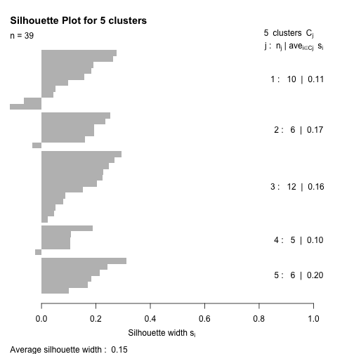 

```r
par(op)

################################################################################################################ Exercise: draw a plot with number of clusters in the x-axis and the
################################################################################################################ average silhouette widths in the y-axis.  Use the information obtained to
################################################################################################################ determine if 5 was the best choice for the number of clusters.
plot(pr.pam$silinfo$clus.avg.widths, type = "b", xlab = "number of clusters", 
    ylab = "average silhouette")
```

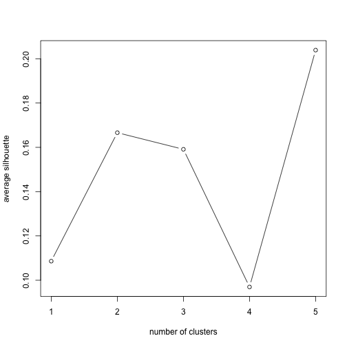 

```r


# Gene clustering
DesMat <- model.matrix(~devStage, prDes)
Fit <- lmFit(prDat, DesMat)
EbFit <- eBayes(Fit)
Hits <- topTable(EbFit, number = 972, coef = grep("devStage", colnames(EbFit)), 
    p.value = 1e-05)
tophits <- rownames(Hits)
topDat <- sprDat[tophits, ]
geneC.dis <- dist(topDat, method = "euclidean")
geneC.hc.a <- hclust(geneC.dis, method = "average")
plot(geneC.hc.a, labels = FALSE, main = "Hierarchical with Average Linkage", 
    xlab = "")
```

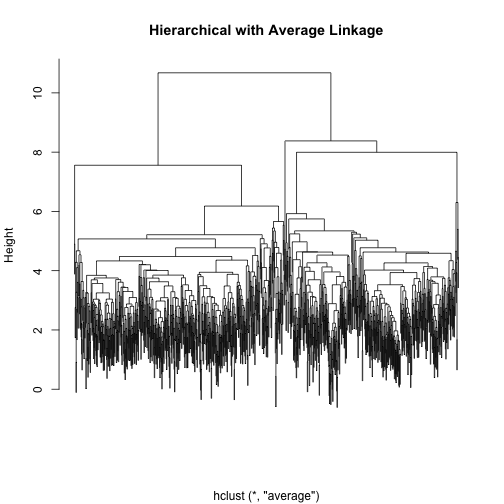 

```r

set.seed(1234)
k <- 5
kmeans.genes <- kmeans(topDat, centers = k)
clusterNum <- 1
plot(kmeans.genes$centers[clusterNum, ], ylim = c(-4, 4), type = "n", xlab = "Samples", 
    ylab = "Relative expression")
matlines(y = t(topDat[kmeans.genes$cluster == clusterNum, ]), col = "grey")
points(kmeans.genes$centers[clusterNum, ], type = "l")
points(kmeans.genes$centers[clusterNum, ], col = prDes$devStage, pch = 20)
```

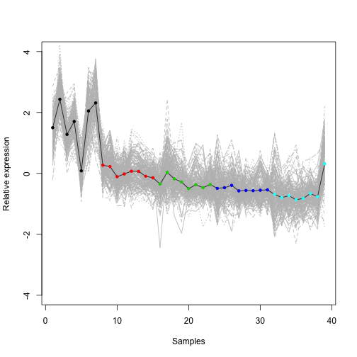 

```r

devStageCols <- brewer.pal(11, "RdGy")[c(2, 4, 7, 9, 11)]
heatmap(as.matrix(topDat), col = jGraysFun(256), hclustfun = function(x) hclust(x, 
    method = "average"), labCol = prDes$grp, labRow = NA, margin = c(8, 1), 
    scale = "none", ColSideColor = devStageCols[unclass(prDes$devStage)])
legend("topleft", levels(prDes$devStage), col = devStageCols, lty = 1, lwd = 5, 
    cex = 0.5)
```

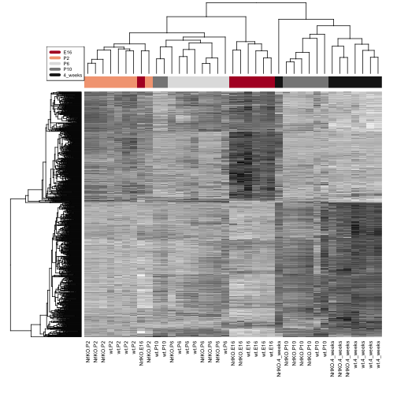 

```r

# Redefining the attributes
annoTopDat <- stack(as.data.frame(topDat))
annoTopDat$probeset <- rownames(topDat)
annoTopDat <- merge(annoTopDat, prDes, by.x = "ind", by.y = "sidChar")
devStageAvg <- ddply(annoTopDat, ~probeset, function(x) {
    avgByDevStage <- aggregate(values ~ devStage, x, mean)$values
    names(avgByDevStage) <- levels(x$devStage)
    avgByDevStage
})
rownames(devStageAvg) <- devStageAvg$probeset
devStageAvg$probeset <- NULL
str(devStageAvg)
```

```
## 'data.frame':	972 obs. of  5 variables:
##  $ E16    : num  -0.628 1.235 -0.419 1.401 0.855 ...
##  $ P2     : num  -1.041 0.7 -0.918 0.737 0.74 ...
##  $ P6     : num  -0.214 -0.26 -0.744 -0.66 0.34 ...
##  $ P10    : num  0.722 -0.683 0.553 -0.779 -0.363 ...
##  $ 4_weeks: num  1.083 -0.838 1.475 -0.523 -1.464 ...
```

```r
heatmap(as.matrix(devStageAvg), Colv = NA, col = jGraysFun(256), hclustfun = function(x) hclust(x, 
    method = "average"), labCol = colnames(devStageAvg), labRow = NA, margin = c(8, 
    1))
```

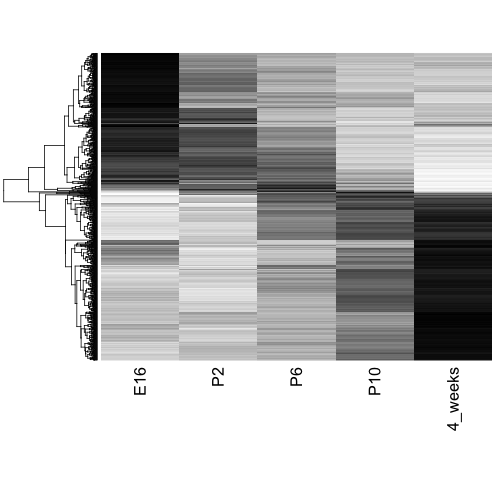 

```r


k <- 4
geneDS.km <- kmeans(devStageAvg, centers = k, nstart = 50)
clust.centers <- geneDS.km$centers
op <- par(mfrow = c(2, 2))
for (clusterNum in 1:4) {
    plot(clust.centers[clusterNum, ], ylim = c(-4, 4), type = "n", xlab = "Develomental Stage", 
        ylab = "Relative expression", axes = F, main = paste("Cluster", clusterNum, 
            sep = " "))
    axis(2)
    axis(1, 1:5, c(colnames(clust.centers)[1:4], "4W"), cex.axis = 0.9)
    matlines(y = t(devStageAvg[geneDS.km$cluster == clusterNum, ]), col = "grey")
    points(clust.centers[clusterNum, ], type = "l")
    points(clust.centers[clusterNum, ], pch = 20)
}
```

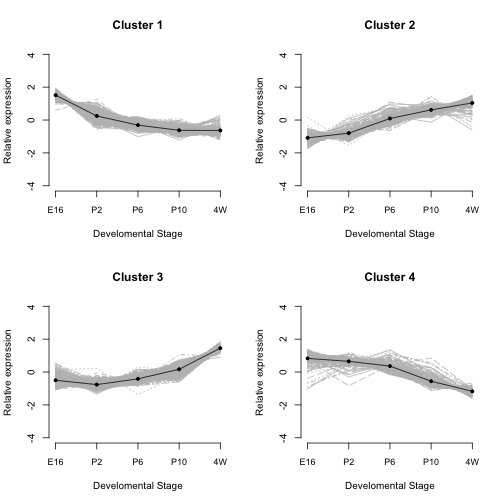 

```r
par(op)


plot(clust.centers[clusterNum, ], ylim = c(-4, 4), type = "n", xlab = "Develomental Stage", 
    ylab = "Average expression", axes = FALSE, main = "Clusters centers")
axis(2)
axis(1, 1:5, c(colnames(clust.centers)[1:4], "4W"), cex.axis = 0.9)

for (clusterNum in 1:4) {
    points(clust.centers[clusterNum, ], type = "l", col = clusterNum, lwd = 2)
    points(clust.centers[clusterNum, ], col = clusterNum, pch = 20)
}
```

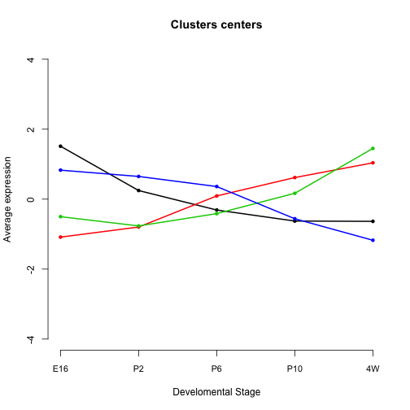 

```r


# Statistical measures to evaluate clusters
pvc <- pvclust(topDat, nboot = 100)
```

```
## Bootstrap (r = 0.5)... Done.
## Bootstrap (r = 0.6)... Done.
## Bootstrap (r = 0.7)... Done.
## Bootstrap (r = 0.8)... Done.
## Bootstrap (r = 0.9)... Done.
## Bootstrap (r = 1.0)... Done.
## Bootstrap (r = 1.1)... Done.
## Bootstrap (r = 1.2)... Done.
## Bootstrap (r = 1.3)... Done.
## Bootstrap (r = 1.4)... Done.
```

```r
plot(pvc, labels = prDes$grp, cex = 0.6)
pvrect(pvc, alpha = 0.95)
```

 

```r

# PCA (principal components analysis)
pcs <- prcomp(sprDat, center = F, scale = F)
plot(pcs)
```

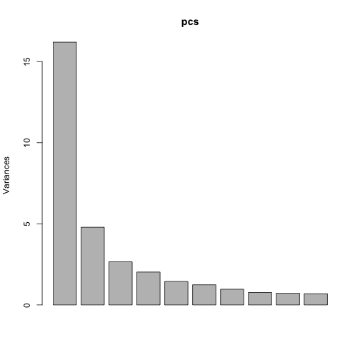 

```r
prinComp <- cbind(prDes, pcs$rotation[prDes$sidNum, 1:10])
plot(prinComp[, c("sidNum", "devStage", "gType", "PC1", "PC2", "PC3")], pch = 19, 
    cex = 0.8)
```

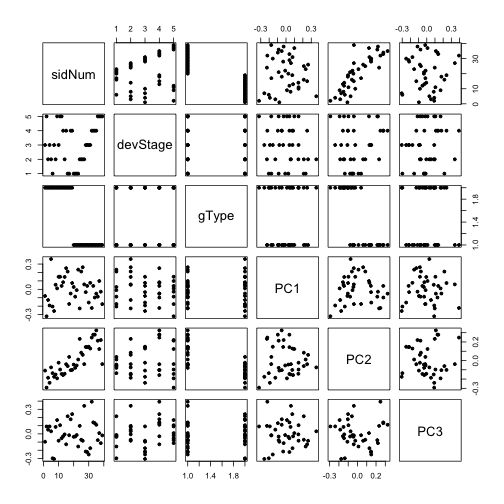 

```r
plot(prinComp[, c("PC1", "PC2")], bg = prDes$devStage, pch = 21, cex = 1.5)
legend(list(x = 0.2, y = 0.3), as.character(levels(prDes$devStage)), pch = 21, 
    pt.bg = c(1, 2, 3, 4, 5))
```

 


